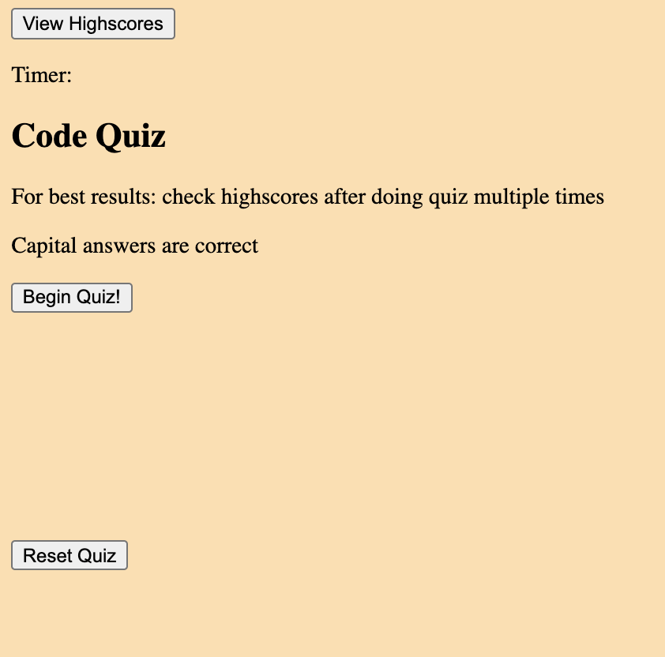

# Code Quiz

## Description
Its a Proof of Concept for a small quiz, that uses a countdown timer to penalize wrong answers, and gives bonus time for correct answers. the user can save the score in local storage and view a list of the recent highscores paired with the name of the user. ('anon' by default)

## Technologies
- Javascript
- Web Api
- HTML
- CSS

## Link
https://nicwille.github.io/code-quiz/

## Screenshot

